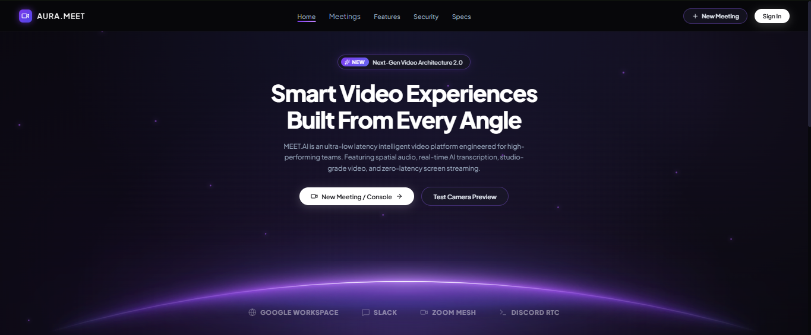

# AURA.MEET

AURA.MEET is a modern video conferencing and meeting workspace inspired by Google Meet. It combines a polished landing experience, secure authentication, instant meeting creation, and a real-time collaboration layer for video calls, chat, lobby flows, and meeting management.

## Preview



## Overview

This project is structured as a full-stack application with:

- A React + Vite frontend for the landing page, authentication, lobby, dashboard, and live meeting experience.
- An Express + MongoDB API for auth, room management, participant tracking, and real-time signaling.
- Socket.IO-powered communication for live meeting events, updates, and collaboration.

## Features

- Modern landing page with a cosmic purple UI and product showcase
- Instant meeting creation and lobby flow
- Protected dashboard for meeting management
- User sign in / sign up flows with session-aware auth
- Meeting room lifecycle with join, leave, and end states
- Real-time participant status and room updates
- Chat support within meetings
- AI-transcript-inspired architecture for future smart video experiences
- Responsive design for desktop and browser-based use

## Tech Stack

### Frontend
- React 19
- Vite
- React Router
- Socket.IO Client
- Lucide React icons

### Backend
- Node.js
- Express.js
- MongoDB + Mongoose
- JWT authentication
- Socket.IO
- Helmet, CORS, rate limiting, and logging middleware

## Project Structure

```bash
gmeet/
├── api/                  # Express backend and Socket.IO API
│   ├── src/
│   ├── package.json
│   └── README.md
├── client/               # React frontend app
│   ├── src/
│   ├── package.json
│   └── README.md
├── docs/
│   └── image.png         # Project landing page screenshot
├── .gitignore
├── README.md             # Project overview and setup guide
└── package.json          # Root workspace metadata (if present)
```

## Getting Started

### 1. Clone the repository

```bash
git clone https://github.com/TheGauravsahu/gmeet.git
cd gmeet
```

### 2. Install frontend dependencies

```bash
cd client
npm install
```

### 3. Install backend dependencies

```bash
cd ../api
npm install
```

### 4. Configure environment variables

Create a `.env` file in the `api` directory with values similar to:

```bash
PORT=5000
NODE_ENV=development
MONGODB_URI=mongodb://127.0.0.1:27017/gmeet
JWT_SECRET=your_secure_secret_here
JWT_EXPIRES_IN=7d
CORS_ORIGIN=http://localhost:5173
```

For a deployed frontend, set `VITE_API_URL` to the backend origin (for example,
`https://api-aurameet.onrender.com`). The frontend adds the API prefix
automatically, so do not include `/api` unless you prefer to specify the full
base URL; both forms are supported.

### 5. Run the apps

Start the backend:

```bash
cd api
npm run dev
```

Start the frontend:

```bash
cd client
npm run dev
```

Then open the frontend URL shown by Vite, typically:

```bash
http://localhost:5173
```

## Common Usage

- Open the landing page to explore the product experience.
- Use the dashboard or instant meeting flow to create a room.
- Join or host a meeting from the lobby.
- Manage meeting state, chat, and participant flows from the meeting UI.

## Development Notes

- The frontend is built to feel like a modern video workspace and uses client-side routing.
- The backend handles authentication, persistence, and WebRTC signaling.
- The project is intended as a Google Meet-inspired clone with a strong product UX and modular architecture.

## License

This project is currently distributed for educational and development purposes. Please review repository usage rights before production deployment or redistribution.

## Contributing

Contributions are welcome. If you want to improve the product experience, add new features, or fix bugs, feel free to open an issue or submit a pull request.
